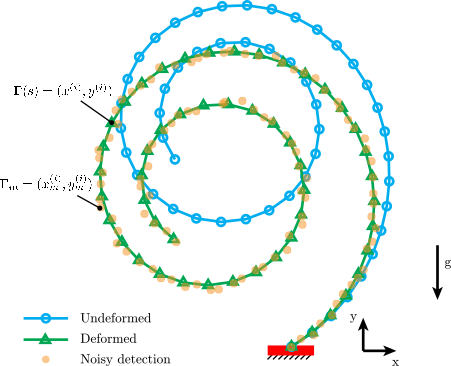

# Inverse Design for 2D Rods from Noisy Data
Codes for form-finding of an arbitrary 2D rod under gravity.
<p align="center">

<br>
<em> Figure 1. An example shown the inverse design of a 2D planar rod from noisy data  </em>
</p>

## Dependence
The codes are designed by python and tested with Python 3.10.
#### Python Dependencies
```bash
python3 -m pip install numpy scipy matplotlib
```

## Scripts Explanation
### main.py
This script contains the functions to retrive the natural shape of a planar rod from a given target shape.
#### Parameters
- ```eta``` - The material properties of the rod, encapsulating the bending deformations via the gravitational force.
- ```noise``` - The standard deviation of the added Gaussian noise.
- ```degree``` - The degree of the polynoimal model used for fitting theta from the measured data.
- ```fileName``` - The directory (path) contains the target pattern. If this is not specified, the codes will generate the random target pattern from scratch.
- ```rotation``` - The rotation angle for the fileName. It is only added when the fileName is not None.
#### Usage
Here is an example:
```bash
python3 main.py noise:=0.5e-3 eta:=15 degree:=15 fileName:=patterns/letterA.txt rotation:=0.0
```

### Citation
If our work has helped your research, please cite the following paper.
```
@article{tong_inverse_design_2024,
  title={Inverse Design of Planar Rods from Noisy Data},
  author={Tong, Dezhong and Hao, Zhuonan and Huang, Weicheng},
  journal={arXiv preprint arXiv:5683697},
  year={2024}
}
```


